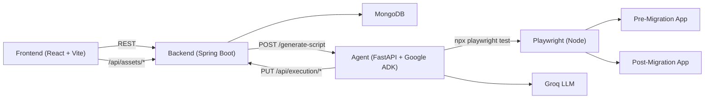

# UI Migration Testing Platform

End-to-end platform to compare **pre-migration** and **post-migration** UI behavior using:
- React dashboard (test orchestration + report UI)
- Spring Boot backend (run lifecycle + persistence + asset proxy)
- Python ADK agent (script generation, Playwright execution, comparison analysis)

---

## 1. What This Project Does

Given two URLs (before and after migration) and a list of business steps, the system:
1. Executes the same steps on both versions.
2. Captures per-step screenshots.
3. Compares outcomes per step.
4. Produces a human-readable report with:
   - step-by-step comparison
   - screenshot pairs
   - plain-language AI interpretation
   - suggested fix when a step differs

Important behavior:
- Step `PASS/FAIL` is **comparison-based** (pre vs post equivalence), not raw Playwright runner status.

---

## 2. High-Level Architecture



---

## 3. Repository Structure

```text
ui-migration-testing-platform/
├── frontend/                      # React dashboard
├── backend/                       # Spring Boot API + orchestration
├── agent/                         # Python ADK execution agent
│   ├── main.py                    # Entrypoint -> app.main
│   └── app/
│       ├── main.py                # FastAPI app routes
│       ├── workflow/              # ADK workflow runner + agents
│       ├── services/              # Script generation, Playwright run, regression analysis
│       ├── integrations/          # Spring callbacks
│       ├── schemas/               # Request schema
│       └── core/                  # Settings/logging
├── urls/pre migration/            # Demo pre-migration app
├── urls/post migration/           # Demo post-migration app
├── input.json                     # Example JSON test input
└── tests/                         # Reference Playwright tests
```

---

## 4. Core Runtime Components

## Frontend (`/frontend`)
- Main workflow UI: create run from JSON/Excel, execute, view stages and final report.
- Uses:
  - `VITE_BACKEND_BASE_URL` (default `http://localhost:8000`)
  - `VITE_AGENT_ASSET_BASE_URL` (fallback direct agent access)
- Key files:
  - `frontend/src/components/NewTest.jsx`
  - `frontend/src/components/Dashboard.jsx`

## Backend (`/backend`)
- Stores test runs in MongoDB.
- Orchestrates full execution via `/api/execution/{id}/run`.
- Proxies screenshots/reports from agent via `/api/assets/**`.
- Key files:
  - `backend/src/main/java/com/backend/backend/controller/ExecutionController.java`
  - `backend/src/main/java/com/backend/backend/controller/AssetProxyController.java`
  - `backend/src/main/java/com/backend/backend/service/AgentClientService.java`
  - `backend/src/main/resources/application.properties`

## Agent (`/agent`)
- FastAPI endpoint `/generate-script`.
- Runs ADK sequential workflow:
  1. Mark running
  2. Generate Playwright script
  3. Execute pre URL
  4. Execute post URL
  5. Analyze comparison
  6. Mark completed
- Key files:
  - `agent/app/main.py`
  - `agent/app/workflow/agents.py`
  - `agent/app/workflow/runner.py`
  - `agent/app/services/script_generation.py`
  - `agent/app/services/playwright_runner.py`
  - `agent/app/services/regression_analysis.py`

---

## 5. Execution Flow (Detailed)

1. User creates test run (JSON or Excel) from frontend.
2. Backend creates `TestRun` with status `CREATED`.
3. User starts run (`POST /api/execution/{id}/run`).
4. Backend marks run `RUNNING` and calls agent.
5. Agent executes ADK workflow:
   - generate script
   - run PRE with `BASE_URL = preMigrationUrl`
   - run POST with `BASE_URL = postMigrationUrl`
   - collect step outcomes + screenshots
   - compare PRE vs POST for each step
6. Agent sends completion payload to backend (`/api/execution/{id}/complete`).
7. Backend persists results, severity, risk, explanation.
8. Frontend fetches run details and displays:
   - stage timeline
   - step comparison cards
   - screenshot pairs
   - AI explanation + suggested fix for failed comparison steps

---

## 6. API Endpoints

## Test run creation
- `POST /api/testruns/create` (JSON)
- `POST /api/testruns/upload` (Excel)

## Execution
- `POST /api/execution/{id}/run` (full orchestration)
- `PUT /api/execution/{id}/start`
- `PUT /api/execution/{id}/complete`
- `PUT /api/execution/{id}/fail`
- `GET /api/execution/{id}`

## Dashboard data
- `GET /api/test-runs`
- `GET /api/test-runs/stats`

## Asset proxy
- `GET /api/assets/screenshots/**`
- `GET /api/assets/reports/**`

## Agent
- `POST /generate-script`
- `GET /health`

---

## 7. Prerequisites

- Java 21+ (project currently runs with Java 25 too)
- Node.js 18+
- npm
- Python 3.10+
- MongoDB (local or Atlas)
- Playwright browsers installed
- Groq API key (optional but recommended; deterministic fallback exists)

---

## 8. Environment Configuration

## Backend (`backend/src/main/resources/application.properties`)
Current defaults:
- `server.port=8000`
- `agent.base-url=http://127.0.0.1:5001`
- `spring.mongodb.uri=...`

## Agent env (`agent/.env`)
Recommended:

```env
GROQ_API_KEY=your_groq_key
GROQ_MODEL=llama-3.3-70b-versatile
SPRING_BASE_URL=http://localhost:8000
PLAYWRIGHT_TIMEOUT_SECONDS=180
```

Note:
- Agent code default for `SPRING_BASE_URL` is `http://localhost:8080`; set it explicitly to `8000` unless your backend runs on 8080.

## Frontend env (`frontend/.env`)
Optional:

```env
VITE_BACKEND_BASE_URL=http://localhost:8000
VITE_AGENT_ASSET_BASE_URL=http://127.0.0.1:5001
```

---

## 9. How To Run (End-to-End)

Run each service in a separate terminal.

## A) Start demo target apps (pre/post)

1. Pre-migration app on `3000`:

```bash
cd "urls/pre migration"
npm install
npm run dev
```

2. Post-migration app on `3001`:

```bash
cd "urls/post migration"
npm install
npm run dev -- --port 3001
```

Why `--port 3001`?
- Both pre and post projects default to `3000`, so post must be overridden.

## B) Start backend

```bash
cd backend
./gradlew bootRun
```

Backend URL: `http://localhost:8000`

## C) Start agent

```bash
cd agent
python3 -m venv venv
source venv/bin/activate
pip install fastapi uvicorn groq python-dotenv requests pydantic google-adk
npm install
npx playwright install
uvicorn main:app --host 127.0.0.1 --port 5001
```

Agent URL: `http://127.0.0.1:5001`

## D) Start frontend dashboard

```bash
cd frontend
npm install
npm run dev
```

Frontend URL (default Vite): `http://localhost:5173`

---

## 10. Running a Test

Option 1: Use frontend UI
- Open New Test page
- Upload JSON/Excel
- Execute

Option 2: API flow

1. Create test run:

```bash
curl -X POST http://localhost:8000/api/testruns/create \
  -H "Content-Type: application/json" \
  -d @input.json
```

2. Run execution:

```bash
curl -X POST http://localhost:8000/api/execution/<TEST_RUN_ID>/run
```

Example:

```bash
curl -X POST http://localhost:8000/api/execution/loan-app-migration-test-01/run
```

## GitHub testcase import

You can create runs directly from testcase JSON stored in GitHub using:
- `POST /api/testruns/github`

Supported GitHub testcase formats:
- `.json`
- `.yml` / `.yaml`
- `.spec.ts` / `.spec.js`

Full usage guide:
- `/Users/yash/Documents/GitHub/ui-migration-testing-platform/docs/GITHUB_TESTCASE_IMPORT.md`

---

## 11. PASS/FAIL Logic (Current)

Per-step comparison status:
- `PASS`: pre and post behavior are equivalent for that step.
- `FAIL`: mismatch detected (behavior or meaningful visual delta).

Returned fields per step include:
- `preStatus`
- `postStatus`
- `comparisonStatus` (authoritative pass/fail for migration comparison)
- `difference` (plain-language explanation)
- screenshot paths

Run-level regression:
- `regressionDetected=true` if one or more steps have comparison failure.

---

## 12. Reports and Runtime Artifacts

Generated inside `agent/`:
- `generated_tests/` - generated spec files
- `screenshots/pre/<test_id>/...`
- `screenshots/post/<test_id>/...`
- `reports/`

These are intentionally git-ignored (except `.gitkeep` placeholders).

---

## 13. Troubleshooting

## Port conflicts
- Backend fails on `8000`: stop existing process or change `server.port`.
- Agent should match backend `agent.base-url` exactly.

## No screenshots in UI
- Check backend asset proxy endpoint:
  - `GET /api/assets/screenshots/...`
- Verify agent is serving static mounts from `/screenshots` and `/reports`.

## LLM rate limit
- Groq 429 can happen.
- Current agent has deterministic fallback so runs can continue without hard failure.

## “All tests passed” unexpectedly
- Ensure your step list includes explicit verification steps for expected migration differences.
- Login-only steps will not detect payment/statements/contact regressions.

## Agent callback fails
- Ensure `SPRING_BASE_URL` in agent env points to backend (`http://localhost:8000`).

---

## 14. Recommended Dev Workflow

1. Keep pre/post target apps running.
2. Start backend.
3. Start agent.
4. Run frontend.
5. Create run from JSON (`input.json`) for deterministic checks.
6. Validate output from both:
   - frontend report
   - `GET /api/execution/{id}` response

---

## 15. Key Files To Read First

- `/Users/yash/Documents/GitHub/ui-migration-testing-platform/agent/app/workflow/agents.py`
- `/Users/yash/Documents/GitHub/ui-migration-testing-platform/agent/app/main.py`
- `/Users/yash/Documents/GitHub/ui-migration-testing-platform/backend/src/main/java/com/backend/backend/controller/ExecutionController.java`
- `/Users/yash/Documents/GitHub/ui-migration-testing-platform/backend/src/main/java/com/backend/backend/service/TestRunService.java`
- `/Users/yash/Documents/GitHub/ui-migration-testing-platform/frontend/src/components/NewTest.jsx`
- `/Users/yash/Documents/GitHub/ui-migration-testing-platform/frontend/src/components/Dashboard.jsx`
