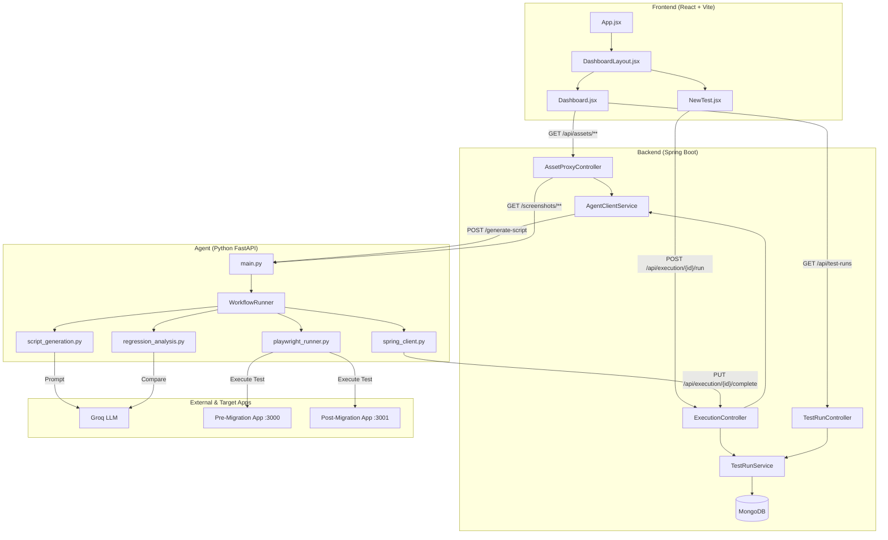
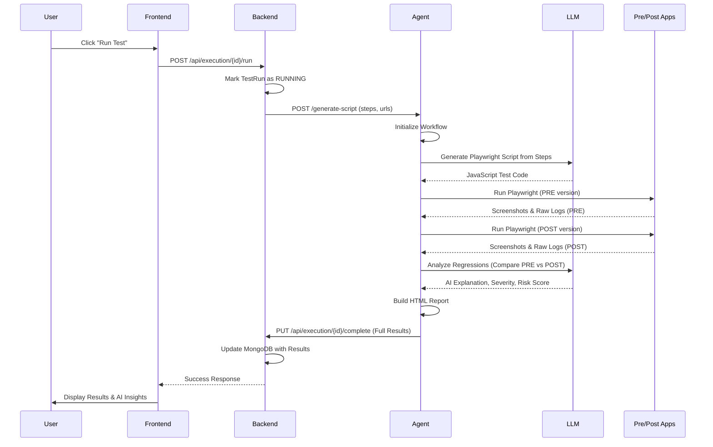

# Repository Structure and Data Flow

This document provides a comprehensive overview of the **UI Migration Testing Platform** repository, including its hierarchical structure, mutual dependencies, and end-to-end execution flows.

## 1. System Architecture

The platform is divided into three primary services that work together to automate UI regression testing during migrations.

---

## 2. Detailed Execution Flow

The following sequence diagram illustrates the lifecycle of a test execution, from the user triggering it on the frontend to the final report generation.

---

## 3. Directory Structure and Responsibilities

### 📂 `frontend/`
The React-based dashboard for user interaction.
- **`src/components/NewTest.jsx`**: Handles test creation and orchestration triggers.
- **`src/components/Dashboard.jsx`**: Visualizes historical runs and detailed analysis.

### 📂 `backend/`
The Java/Spring Boot orchestration layer.
- **`src/main/java/.../controller/ExecutionController.java`**: Orchestrates the run lifecycle.
- **`src/main/java/.../controller/AssetProxyController.java`**: Proxies files from the agent to bypass CORS and centralize access.
- **`src/main/java/.../service/AgentClientService.java`**: Manages communication with the Python Agent.

### 📂 `agent/`
The AI-powered execution engine.
- **`app/services/script_generation.py`**: Bridges natural language business steps to executable Playwright code.
- **`app/services/playwright_runner.py`**: Manages dual-environment execution and artifact collection.
- **`app/services/regression_analysis.py`**: Interprets visual and behavioral differences using LLMs.
- **`app/workflow/runner.py`**: A state-machine approach to ensuring all steps complete or fail gracefully.

### 📂 `urls/`
Contains the target applications under test.
- **`pre migration/`**: The legacy version of the UI.
- **`post migration/`**: The updated version being validated.

---

## 4. Key Dependencies

| Service | Key Technologies | Primary Dependency |
| :--- | :--- | :--- |
| **Frontend** | React, Vite, CSS Modules | Backend API (`:8000`) |
| **Backend** | Spring Boot, MongoDB, RestTemplate | Agent API (`:5001`), MongoDB |
| **Agent** | FastAPI, Playwright, Groq LLM, ADK | Backend Callbacks, Groq API, Target Apps |

---

## 5. Mutual Interlinking

1.  **Orchestration Link**: Backend triggers Agent, but Agent provides callbacks to Backend to update status (`start`, `complete`, `fail`).
2.  **Asset Link**: Frontend requests images from Backend (`/api/assets`), which Backend fetches from Agent (`/screenshots`).
3.  **Data Link**: All three layers share the `TestRun ID` as the primary key for tracking state and artifacts across the distributed system.
